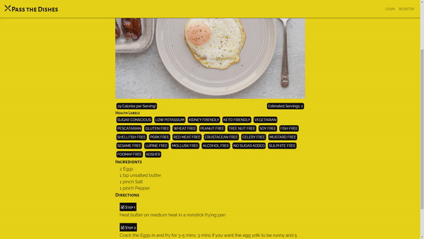

# PassTheDishes - A social network encompassing food

I started creating a smaller social network to share, comment and analyze recipes with different users. Users can input their favourite recipes and the Edamam API will process the recipe and provide nutritional info.

This web application uses React.js, Redux, Express, Node.js, and Firebase.

The node server communicates with the Edamam API to provide nutritional information. Link to the API can be found below.
https://developer.edamam.com/edamam-nutrition-api

## Recipe Details

## Features to Implement

-   [ ] More Nutritional Information can be displayed in a mobile friendly and coherent way
-   [ ] Users should have personalized feeds based on posts they will be able to like and other users that they should be able to follow
-   [ ] More User Account Personalization
-   [ ] Should add whimsical animations and more CSS customization to the application
